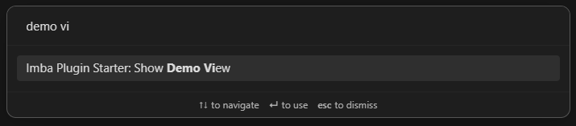

# Create Obsidian Plugins with Imba

> [!WARNING]
> This is an experiment in the works. See [Known issues](#known-issues) for what's not so great right now.

This repo is a starter template for building an [Obsidian](https://obsidian.md) plugin using [Imba](https://imba.io).
To take it for a quick test-drive, follow the steps in [Speedrun](#speedrun).

## Speedrun
If you have Obsidian and Nodejs (+npm) installed and want to get started with this template in the most straight-forward way, follow the steps below.

1. Create a new repository from this template to start a new plugin
    - See [Creating a repository from a template](https://docs.github.com/en/repositories/creating-and-managing-repositories/creating-a-repository-from-a-template) for how-to.
2. Clone your repo into the `.obsidian\plugins` directory of you [Test Vault](#test-vault) and cd into it
3. Edit the [package.json](./package.json), [manifest.json](./manifest.json), [LICENSE](./LICENSE) and [README](./README.md) files to fit your plugin
3. Run `npm install` to bring in all the dependencies
4. Run `npn run dev` to compile the plugin
    - `main.imba` -> `main.js`
    -  `styles.imba` -> `styles.css`
5. Open your Obsidian [Test Vault](#test-vault) and enable the `Imba Plugin Starter` plugin
6. You may now interact with the plugin functionality in Obsidian
7. When you are ready to build a package, run `npm run build` to send minified output to the `./dist` folder
    - `main.imba` -> `./dist/main.js`
    - `styles.imba` -> `./dist/styles.css`
    - `manifest.json` -> `./dist/manifest.json`
8. Read the [Plugin guidelines](https://docs.obsidian.md/Plugins/Releasing/Plugin+guidelines) in the [Obsidian Developer Docs](https://docs.obsidian.md) if you want to get your plugin listed on the [Obsidian Plugin Directory](https://obsidian.md/plugins)

## Benefits
Use this template if you want to:

### 1. Quickly prototype your plugin idea with Imba
If you enjoy using Obsidian and want to create plugins for it, this template gives you a chance to use Imba as your preferred language. Simply clone it, install the dependencies and start creating. 

It can serve as a quick reference on how to bridge imba components with the Obsidian Developer Api.

Take a look at the "Usage" section for detailed guidance.

### 2. Live-test your plugin and iterate with a tight feedback loop
Powered by [Vite](https://vitejs.dev/) which delegates to [esbuild](https://esbuild.github.io/) and [Rollup](https://rollupjs.org/) for fast compilation and efficient bundling.

This starter comes with the usual `npm run dev` to watch for changes in your `.imba` files and rebuild your plugin.

See the "Flow state" for guidance on how to setup a seamless integration with Obsidian in order to live test your plugin as you build it.

### 3. Easily build an optimized version of your plugin to publish 
Use `npm run build` to bundle and minify your Imba code into compact JavaScript and CSS. The relevant files are rendered into a `./dist` directory for easy copy/pasta into a realease.

## Features
When installed in your [Test Vault](#test-vault), this plugin provides the following features:

### Interactive Status Indicator


An Imba component `StatusIndicator` that is mounted into the status bar. When clicked, will trigger a background task which also displays notification before and after the task completes.


The same simulated background task can be triggered with the command `Imba Plugin Starter: Simulate Background Activity`.


### Tally Counter Modal
Open a Modal from a [Ribbon icon/action](https://docs.obsidian.md/Plugins/User+interface/Ribbon+actions) and a Command `Imba Plugin Starter: Open Tally Counter`.


The `Tally Counter Modal` showcases three Imba components `ValueDisplay`, `CounterButton` and `ResetButton`. The components are mounted into different areas in an Obsidian `Modal`. They collaborate through events and a shared in-memory value store, `ValueRegister`, to provide a cohesive UX.

### Demo View
Show a `View` provided by this plugin by invoking a command `Imba Plugin Starter: Show Demo View`.




The `Demo View` showcases component re-use in a different context. It mounts the same `StatusIndicator` component used in the stausbar -- this instance does not trigger any background activity when clicked.

It also allows spawning multiple `TallyCounter` components, seeded with random initial and step values. The `TallyCounter` component, composes the `ValueDisplay`, `CounterButton` and `ResetButton` components in a slightly different manner from the Tally Modal.

### Render markdown code block as component
The plugin registers a markdown code block processor which can parse and render a `TallyCounter` component given a `tally-counter` code block.

> ```tally-counter
> initial:10, step:5, value:100
> ```


### Modify the behaviour of the plugin via Settings


## Usage
> [!NOTE]
> TODO 
> Develop plugin
> Release plugin

## Test Vault
While building your Obsidian plugin, it is possible to damage the data in your vault. To minimize risk to your data, consider developing and testing your plugin in a test vault. A test vault is any vault that has only test files, NOT your actual notes. 

With this approach, even if your plugin code (un?)intentionally does something wild and nukes all the data and files, you can rest easy knowing your real data is safe.

To setup a test vault, 
1. Create a new vault, name it something like "My Test Vault" or "obsidian-test-vault". 
2. Develop and install your plugin in the test vault

In the [Development flow](#development-flow) section, we'll take a look at how you can develop your plugin outside of the Test Vault and still test your plugin in the sandbox.

## Development flow
See [Development workflow](https://docs.obsidian.md/Plugins/Getting+started/Development+workflow) to get a basic idea of how plugin development goes in "Obsidianland". If you followed the steps in the [speedrun](#speedrun), you will be using the approach where you develop your plugin inside a folder within your "sandbox".

> [!NOTE]
> TODO 
> Mapping the `Reload app without saving` command to `ctrl+R` 
> Using [Hot-Reload](https://github.com/pjeby/hot-reload) with the `.hotreload` file
> Developing outside the [Test Vault](#test-vault) with `OBSIDIAN_TEST_VAULT_PATH` environment variable

## Known issues
This is an alpha-level experiment with warts, please proceed with caution.

- [ ] Type sense is not available for the `Obsidian API` in `.imba` files
- [ ] Refactoring, i.e. renaming with say `F2` is not supported
- [ ] Linting is showing errors that do not make sense
- [ ] Generated source maps are useless as they do not tie back to the Imba source
```
(vite-plugin-imba plugin) Sourcemap is likely to be incorrect: a plugin (vite-plugin-imba) was used to transform files, but didn't generate a sourcemap for the transformation. Consult the plugin documentation for help
```
- [ ] Does not offer an example of persisted component state
- [ ] When used with the "Hot Reload" plugin, Imba component re-mounts result in an error message
    - Workaround: Reload plugin / Refresh obsidian, i.e. `Reload app without saving` command
- [ ] No automated unit or e2e tests

## References
Here are some useful tidbits for Obsidian Plugin Developers

- [Obsidian Developer Docs](https://docs.obsidian.md)
    - How to build and package plugins and themes
    - Docs for the Obsidan API
    - How to publish your plugin
- [Obsidian API](https://github.com/obsidianmd/obsidian-api)
    - start in the `obsidian.d.ts` file
- [Obsidian Sample Plugin](https://github.com/obsidianmd/obsidian-sample-plugin)
    - Official sample plugin based on JavaScript/[TypeScript](https://www.typescriptlang.org/)
- [Awesome Obsidian](https://github.com/kmaasrud/awesome-obsidian#for-developers)
- Obsidian and Imba on Discord 

## Alternatives
Other ways to whip up an Obsidian Plugin if Imba is not your thing.

- JavaScript / TypeScript
    - [Obsidian Sample Plugin](https://github.com/obsidianmd/obsidian-sample-plugin)
- React
    - [obsidian-react-starter](https://github.com/obsidian-community/obsidian-react-starter)
- Vue
    - [Otto-J/Obsidian-Vue-Starter](https://github.com/Otto-J/Obsidian-Vue-Starter)
    - [guopenghui/obsidian-vue-starter](https://github.com/guopenghui/obsidian-vue-starter)
- Svelte
    - [obsidian-svelte-plugin](https://github.com/emilio-toledo/obsidian-svelte-plugin)
    - [Obsidian-Svelte-Starter](https://github.com/Quorafind/Obsidian-Svelte-Starter)
- Rust
-   [Obsidian Plugin: Rust Bolierplate](https://github.com/trashhalo/obsidian-rust-plugin)